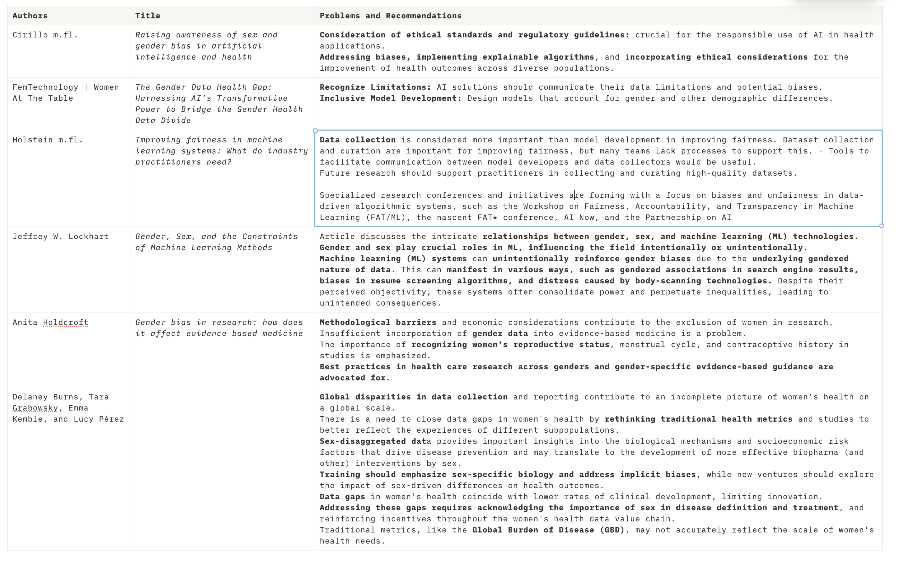

# Meeting w. Théo

## All output files
* https://github.com/yasminsarkhosh/machine-learning-bsc-thesis-2024/blob/3069e009fea22858b83fd6f60bcf3deef6488a93/code/finals
## Extracted sentences by keywords
* https://github.com/yasminsarkhosh/machine-learning-bsc-thesis-2024/blob/main/code/finals/extracted_sents_keywords_refined.csv
## Selected pepers: metadata and extracted sentences by list of keywords
* https://github.com/yasminsarkhosh/machine-learning-bsc-thesis-2024/blob/main/code/finals/papers_with_sents_by_keywords_metadata.csv
* https://github.com/yasminsarkhosh/machine-learning-bsc-thesis-2024/blob/main/code/finals/list_of_keywords.csv

## Notebooks
* Data extraction: https://github.com/yasminsarkhosh/machine-learning-bsc-thesis-2024/blob/main/code/data_extraction.ipynb 
* Data Viz: https://github.com/yasminsarkhosh/machine-learning-bsc-thesis-2024/blob/3069e009fea22858b83fd6f60bcf3deef6488a93/code/data_visualistion.ipynb
* Images: https://github.com/yasminsarkhosh/machine-learning-bsc-thesis-2024/blob/3069e009fea22858b83fd6f60bcf3deef6488a93/images

## Annotation experiment: Papers from the MICCA 2023 with ‘cancer’ in their title
* Categories: 
  * Organs
  * Image types
  * Number of datasets
  * Sex-specific cancer
  * Demographic information
    - How do they define their data?
    - Do they use demographic information in their datasets?
    - How do they evaluate their results?
    - Do they consider how the data affects their results?
  * Other subgroups

### Findings: annotation of papers with cancer in the title
* 14 out of 23 papers had no mentioning of demographic information
* 8 papers with demographic information mentioned in their paper
  - 1 paper defined their data collection by age and gender, data was collected from 7 medical centres (geolocation)
  - the 7 others have data collected by geolocation, however these are vaguely mentioned in their paper
* 23 out of 23 papers do not mentioned anything about fairness nor bias
  - 1 paper mentioned a “sightly gender imbalance”
  - 1 paper mentioned datasets are unbalanced
* Organs:
  - Breast/breast tissue: 7 papers
  - Cervix: 1 paper
  - Colorectal: 3 papers
  - Kidney: 1 paper
  - Liver: 1 paper
  - gall bladder: 1 paper
  - prostate gland: 2 papers
  - lungs/lung tissue: 3 papers
  - head and neck: 2 papers

***
## Annotation scheme: reflections
### Purpose of the annotation: To examine fairness and bias in research papers
* How can researchers in medical AI, specifically in medical imaging, incorporate less bias’ and more fairness into their models?
* What are the practices and/or methods that can reduce bias and promote fairness when creating models?
* Do they implement recommendations that address bias and prevent algorithm discrimination?
  * Recommendations from:
  

* How can we use demographic information to analyse papers?
    * What is it?
    * How do we define demographic information?
    * How are they useful for analyzing fairness and bias?
* Are there any other methods useful for analysing papers?
* Categories for annotation scheme: 
  * Organs
  * Image types
  * Number of datasets
  * Sex-specific cancer
  * Demographic information

* Inspiration: [The Values Encoded in Machine Learning Research](https://www.notion.so/The-Values-Encoded-in-Machine-Learning-Research-f2d9f2ce77a442f6bddfaaeaa4446f8e?pvs=21)
    
## Further details: datasets
* Do they mention, critique, evaluate, or reflect upon their dataset?
  - Do they evaluate the quality of their dataset?
  - Are there any imbalances in their data collection? and do they consider how these imbalances might affect their model?
  - Do they consider the defined subgroups in their datasets, such as distinguishing data by patients and not by sex too? Are patients further differentiated by age, ethnicity, and/or geolocation?
  - Do they identify weaknesses within their model?
  - Do they contemplate the potential social impacts of their models?

## Meeting recommendations and ideas
* Compare results from 2023 to another year (within the past 5 years)
* Look into what differs papers with demographic info with papers that has no mentions 
  * maybe by category?
* Look into datasets:
  * Info about dataset(s): possible to distinguish data by demographics/evaluate biases by what the dataset is missing/not missing 
  * Dataset and groups: selective choice by papers?
### Extracted sentences:
  * Awareness about biases and data collection (quality) 
  * Addressing biases and ensuring fairness by methods/strategies or just "talking about it"
  * Actively preventing biases vs passively mentioning biases
    * Aggrated counts show the list of keywords occuring in each paper, however there is a difference between mentioning something about fairness and biases and another to actively prevent/address/reduce bias and ensure/provide fairness 
  * Examples: 
    * miccai23vol1/paper_25.pdf "the inferior performance of the global clustering is due to the visual bias underlying the whole dataset." 
      * visual bias? what is underlying the whole dataset?
    * miccai23vol1/paper_59.pdf "mesh2ssm also includes an analysis network that operates on the learned correspondences to obtain a data-driven
    template point cloud (i.e., tem-plate point cloud), which can replace the initial template, and hence reducing the bias that could arise from template selection. [13,21] analysis module helps in mitigating bias and capturing non-linear characteristics of the data."
      * what bias?
      * mitigating bias, but how?
  * Annotation guide for determing which papers are actively preventing biases and ensuring fairness vs papers that do not
  * Software: PDF annotator - Théo can help if this is something I wish to approach further
### Ideas for Discussion section
* Extracted sentences:
  * If no time, mention the difference by examples
  * AI field vs Medical field: 
    * is the the lack of awareness of data collection quality and thus prioritizing examining potential biases and how these affect real-world provlems an issue in general with regards to medical research or related to the field of AI or Medical? 
### Recommendations for analysis and splitting PDFs
  * GROBID
  * Label studio

