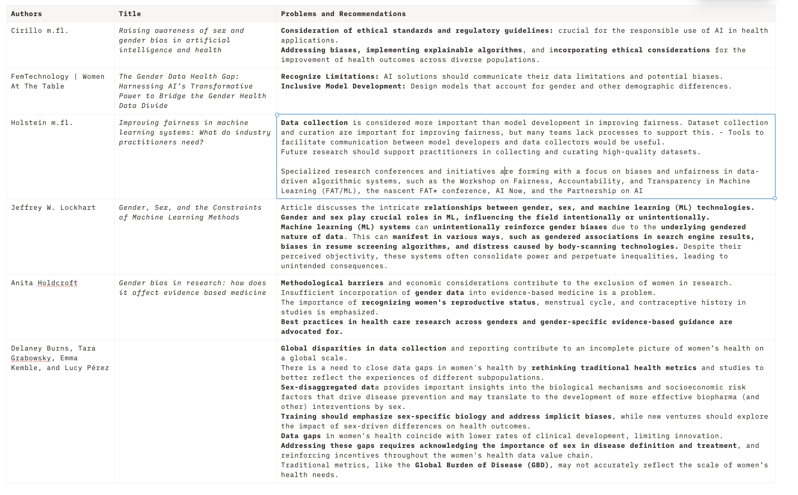
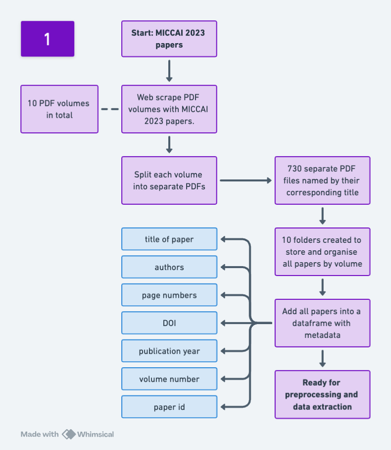
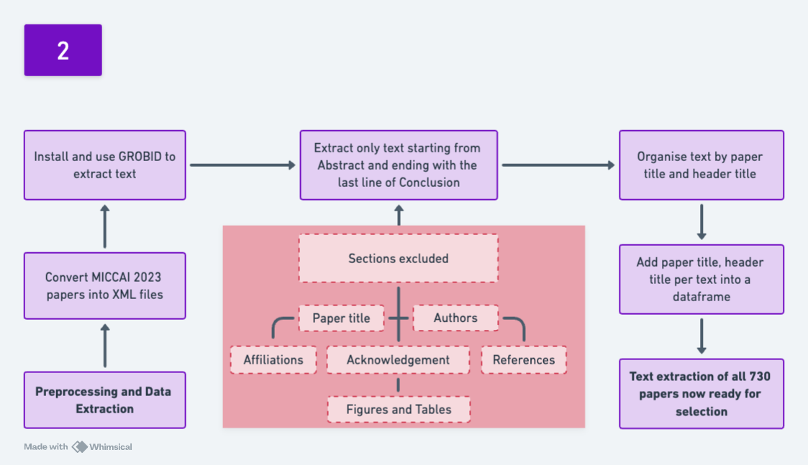
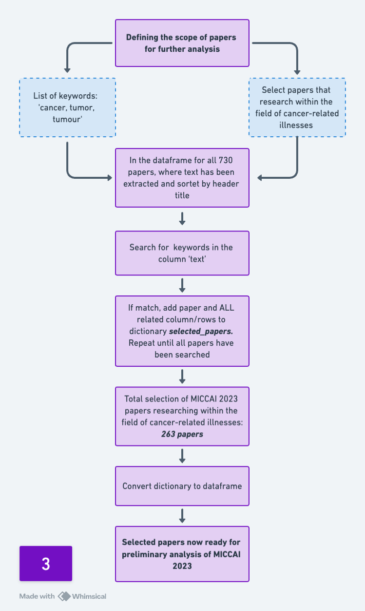

The material in the weekly-meetings-yasmin.md is derived from "Whitaker Lab Project Management" by Dr. Kirstie Whitaker and the Whitaker Lab team, used under CC BY 4.0. weekly-meetings-yasmin.md is licensed under CC BY 4.0 by [Yasmin Sarkhosh].

# Yasmin's Weekly Meeting Notes

* [06 feb 2024](#date06-feb-2024)
* [13 feb 2024](#date-13-feb-2024)
* [20 feb 2024](#date-20-feb-2024)
* [27 feb 2024](#date-27-feb-2024)
* [05 mar 2024](#date-05-mar-2024)
* [12 mar 2024](#date-12-mar-2024)
* [19 mar 2024](#date-19-mar-2024)
* [22 mar 2024](#date-22-mar-2024)
* [02 apr 2024](#date-02-apr-2024)

***
***

### Date: 06 feb 2024
### Who helped you this week?
N/A
### What did you achieve?
* Settled on a research direction 
* Finished preliminary problem statement 
* Experiments: 
  * examining datasets in papers in MICCA 2023 for demographic information
* Looking into potential research questions 
* Looking for relevant literature 
* Setting up a Git repo with weekly meetings
* https://github.com/yasminsarkhosh/machine-learning-bsc-thesis-2024.git

### What did you struggle with?
N/A

### What would you like to work on next week?
* Finalizing research questions 
* Finalizing the methodology for the project
* Experiments - looking into MICCA 2023 
  * Experiment 1 - on webpage**
      - ‘command F’ - ‘cancer’
      - randomly selecting papers

### Where do you need help from Veronika?
* Finalizing research questions 
* Finalizing the methodology for the project!
* Setting research boundaries (finalizing a scope for the project) 

### Any other topics
N/A

### What are the agreements after this meeting? (to fill in after the meeting) 

#### Looking into MICCA 2023 ONLY
#### Write instructions - Experiment 1
- How did I find the papers?
    - ‘command F’ - ‘cancer’
- Annotation scheme
    - Categories: why these?
    - How do I examine/annotate papers? 
- Find number of all papers
    - Define the number of rows from the total number of papers
    - Add all papers
    - Filter by ‘cancer’
        - What organ is in focus?
        - What image type?
    - Find the dataset(s)
        - Number of dataset(s)?
        - What are the demographic information?
        - What are other subgroups in mentioned in the paper?
- Think of a 'analysis code' for my method that makes it applicable for future analysis
- Remember: insert all experiments into ‘weekly meetings’

***
### Date: 13 feb 2024
### Who helped you this week?
N/A

### What did you achieve?
Extracting all papers from MICCA 2023 webpage into an Excel sheet 
  * Experiment 2 - Excel Power Query**
    - save page as text file in ARC browser
    - open the file with Excel
        - data - get data - from text file - clean and remove html tags
        - result: a whole list of papers in excel
        - 730 papers in total extracted from micca 2023 webpage
        - 23 papers with 'cancer' in their titles
        - in progress: check for 'cancer' in the content of the papers
  * Manually found 10 volumes in PDF format with all 730 papers
  * Experiment 3 - search for cancer-related papers (not just by title)
    - Downloaded 10 PDF volumes with containting all papers from this url: https://link.springer.com/book/10.1007/978-3-031-43999-5  
    - opened the PDFs and searched for 'cancer' by command + F 
      - papers, with 'cancer' in their titel was marked with orange
      - papers, with 'cancer' beyond their titel was marked with purple
    - No. of papers with 'cancer' in their title: 23
    - No. of papers with 'cancer' beyond their title (in the content): in progress (17 papers)
    - No. of papers in total: 730

  * Annotation scheme
    - Planning how to analyse each paper for demographics   
### What did you struggle with?
Writing code that will:
* Extract ALL 730 PDFs from the MICCA 2023 webpage by webscrapping 
  - Currently managed to extract all hmtl from the page, however still struggling with downloading each pdf from hmtl into a folder
    - Managed to extract all direct pdf urls into a list, however still not able to extract text from/download each pdf
* Extract PDFS with 'cancer' in their title from webpage

### What would you like to work on next week?
* Continueing my analysis of demographics in papers

### Where do you need help from Veronika?
* Web scraping/writing code to help me find demographic information
* Keep me on the right track  
* Figuring out which steps to take next
  - What is important
  - The boundaries of papers: cancer in the title and/or cancer in the content

### Any other topics
* I need to reschedule meetings if possible due to work (not all tuesdays, but some)

### What are the agreements after this meeting? (to fill in after the meeting) 
Meeting notes:
- Look into variables: pretend that you have the data
- There are papers that are useful about MICCA 2023 in Notion meeting notes
- Make excel sheet into csv files
- flowchart: reasoning for selecting papers and the annotation
- Working next tuesday: use weekly meetings for questions

***
### Date: 20 feb 2024
### Who helped you this week?
N/A

### What did you achieve?
#### From the latest meeting:
* Converted lists into csv files
  - https://github.com/yasminsarkhosh/machine-learning-bsc-thesis-2024/blob/main/experiments/demographic_keywords.csv
  - https://github.com/yasminsarkhosh/machine-learning-bsc-thesis-2024/blob/main/experiments/organs_other.csv
  - https://github.com/yasminsarkhosh/machine-learning-bsc-thesis-2024/blob/main/experiments/searchwords.csv
* Converted MICCAI 2023 excel into csv file (https://github.com/yasminsarkhosh/machine-learning-bsc-thesis-2024/blob/main/experiments/miccai2023_scheme.csv)
#### Experiment 3
* Finished Experiment 3 - search for cancer-related papers (not just by title)
* From the extracted pdfs (10 volumens, combined contains 730 papers): 
    - look for ‘cancer’ in each paper, select papers that have 'cancer' in their content and not in their title
    - 178 out of 730 papers were found with the search word ‘cancer’ in their content
    - 23 out of 730 papers with 'cancer' in their title (and also content)

#### Experiment 4
* Trying to see if I can extract text from PDFs into a dataframe with MyMuPDF:
  - Each row is the title of the paper
  - Columns: text, headings (divide text by secton such as Abstract, Introduction etc)

#### Experiment 5 - extract 730 papers into a csv file by title, author(s) and year
* Inspired from the recommended paper from last weeks Meeting Notes:
  - https://github.com/purrlab/MICCAI-paper-analysis/

### What did you struggle with?
#### Experiment 5 - extract 730 papers into a csv file by title, author(s) and year
- Managed to extract volumen 1 (part 1 of MICCAI 2023) into a dataframe from the copied HTML file, but not the other 9 parts

### What would you like to work on next week?
* To have a finished dataset of all 730 papers, organised into a csv file by title, author(s), year
* To establish the way best to work with the text analysis/annotation of the pdf files:
  - Is the group of 23 papers (cancer in title) enough for my analysis or should I go by the 178 papers too (cancer in content)?

### Where do you need help from Veronika?
I have done so many experiments and had so many issues with extracting text from PDFs files that I might need to know what I should focus on next.
However, I have set a deadline for the end of this month (28 feb), where a dataset should be ready for analysis/annotation process

### Any other topics

### What are the agreements after this meeting? (to fill in after the meeting) 

***
### Date: 27 feb 2024
### Who helped you this week?
N/A

### What did you achieve?
* Extracted 730 PDFs into a csv file with the help of https://github.com/purrlab/MICCAI-paper-analysis/
* Looking further into my annotation scheme and how I want to define it
* Experimenting with converting the PDFS into docx - txt files with the purpose of extracting the text in jypyter notebook
  - Converted the 10 volumens of PDFs into text files with utf-8 encoding 
  - Saved all 10 volumens of text files as 1 complete text file

### What did you struggle with?
* To extract 730 PDFs into a csv file with the help of https://github.com/purrlab/MICCAI-paper-analysis/
* To extract text from the 730 PDFs into seperate files 
  - One file one paper, thus 730 papers in total
  - Still working on this one

### What would you like to work on next week?
* Settling on my annotation scheme
  - defining the properties I want to annotate per paper and 
  - how to analyze those properties
* To ask Théo to help with the text extraction and annotation 

### Where do you need help from Veronika?
N/A

### Any other topics
* I can't join meeting today (the 27 feb) as I'm working 

### What are the agreements after this meeting? (to fill in after the meeting) 

***
### Date: 05 mar 2024
### Who helped you this week?
N/A

### What did you achieve?
* Looked into which key demographic information I want to analyse
  - How do these research papers define and group their data?
    * Dataset: Gender, Age, Geolocation, Gender-specific illness, Subgroups
    * Idea: looking into authors as well? Educational background, Departments, Area?
* Annotated 23 papers with cancer in their title in Excel 
* Managed to somewhat write a code that somewhat splits PDFs into separate research papers
  - Some minor errors in the splitting, however all volumes are now seperated into 730 research papers
* Wrote Théo a mail asking for help. We will meet thursday this week
* Succesfully installed PDF annotator 

### What did you struggle with?
* Managed to somewhat write a code that somewhat splits PDFs into separate research papers

### What would you like to work on next week?
* Annotation and analysis

### Where do you need help from Veronika?
N/A

### Any other topics

### What are the agreements after this meeting? (to fill in after the meeting) 
* Make columns into 0/1
* clean the experiment form raw to clean by making it more database friendly 
* annotation guidelines: reproducable, add as appendix in the report 
* make script for clean data analysis

***
***
### Date: 12 mar 2024
Due to illness there is nothing added for this week

***
***
### Date: 19 mar 2024
### Who helped you this week?
N/A

### What did you achieve?
#### Organizing my notebooks and notes
* Gathering useful notes from my readings into schemes
* Organizing codes and csv files in github
* Rewriting and refining the jupyter notebooks 

#### Preprocessing, Data Extraction and Analysis/Data viz
* Wrote/refined script, that: 
  * extracted relevant information (e.g., mentions of demographic data, ethical considerations, methodologies for bias mitigation) from the papers.
  * extracted relevant informatio by a list of keywords
  * structured data according to key indicators
  * designed a data structure (e.g., a pandas DataFrame) where each row represents a paper by title and columns represent extracted sentences by key indicators
  * data viz. of key indicators in papers

Outputs can be find here:  
* https://github.com/yasminsarkhosh/machine-learning-bsc-thesis-2024/blob/c6d0d3eba14533e95ea9ad6477edfe379699a291/images
* https://github.com/yasminsarkhosh/machine-learning-bsc-thesis-2024/blob/41ab21bbbd9a86c78df3ecd3cbe058d84a4b21ad/code/finals
* https://github.com/yasminsarkhosh/machine-learning-bsc-thesis-2024/blob/main/code/data_vis.ipynb
* https://github.com/yasminsarkhosh/machine-learning-bsc-thesis-2024/blob/41ab21bbbd9a86c78df3ecd3cbe058d84a4b21ad/code/database_analysis_output

#### Wrote a script that searches for 'cancer' in text 
* The papers were choosen by: 
  * defining the text/relevant content of a paper to start from Abstract ending with incl. Conclusion
  * authors and affiliations, Acknowlegdement and References were excluded from the content
  * then searching for keyword 'cancer' in the defined text for each 730 paper
  * result: 189 papers were selected and added into a dataframe 
  * previously, I manually counted the number of papers by searching from keywords 'cancer', 'tumor', 'tumour' 
    * I found 178 papers excluding papers with keywords in their title
    * with the titles its a total of 201 papers
    * therefore I have approved the selected 189 to fit the criteria when looking for 'cancer' only 

#### Annotation experiment: Papers from the MICCA 2023 with ‘cancer’ in their title
* Categories: 
  * Organs
  * Image types
  * Number of datasets
  * Sex-specific cancer
  * Demographic information
    - How do they define their data?
    - Do they use demographic information in their datasets?
    - How do they evaluate their results?
    - Do they consider how the data affects their results?
  * Other subgroups

#### Findings: annotation of papers with cancer in the title
* 14 out of 23 papers had no mentioning of demographic information
* 8 papers with demographic information mentioned in their paper
  - 1 paper defined their data collection by age and gender, data was collected from 7 medical centres (geolocation)
  - the 7 others have data collected by geolocation, however these are vaguely mentioned in their paper
* 23 out of 23 papers do not mentioned anything about fairness nor bias
  - 1 paper mentioned a “sightly gender imbalance”
  - 1 paper mentioned datasets are unbalanced
* Organs:
  - Breast/breast tissue: 7 papers
  - Cervix: 1 paper
  - Colorectal: 3 papers
  - Kidney: 1 paper
  - Liver: 1 paper
  - gall bladder: 1 paper
  - prostate gland: 2 papers
  - lungs/lung tissue: 3 papers
  - head and neck: 2 papers

***
### Annotation scheme: reflections
#### Purpose of the annotation: To examine fairness and bias in research papers
* How can researchers in medical AI, specifically in medical imaging, incorporate less bias’ and more fairness into their models?
* What are the practices and/or methods that can reduce bias and promote fairness when creating models?
* Do they implement recommendations that address bias and prevent algorithm discrimination?
  * Recommendations from:
  

* How can we use demographic information to analyse papers?
    * What is it?
    * How do we define demographic information?
    * How are they useful for analyzing fairness and bias?
* Are there any other methods useful for analysing papers?
* Categories for annotation scheme: 
  * Organs
  * Image types
  * Number of datasets
  * Sex-specific cancer
  * Demographic information

* Inspiration: [The Values Encoded in Machine Learning Research](https://www.notion.so/The-Values-Encoded-in-Machine-Learning-Research-f2d9f2ce77a442f6bddfaaeaa4446f8e?pvs=21)
    
#### Further details: datasets
* Do they mention, critique, evaluate, or reflect upon their dataset?
  - Do they evaluate the quality of their dataset?
  - Are there any imbalances in their data collection? and do they consider how these imbalances might affect their model?
  - Do they consider the defined subgroups in their datasets, such as distinguishing data by patients and not by sex too? Are patients further differentiated by age, ethnicity, and/or geolocation?
  - Do they identify weaknesses within their model?
  - Do they contemplate the potential social impacts of their models?

### Others
* Finalized findings from the annotation scheme experiment
* Annotation scheme and analysis
  * Annotation guide
  * Annotation scheme
    * Finalize a scheme, that is supported by theory, recommendations, litterature
    * Make a list of recommendations by references to address fairness and bias' in medical AI

### What did you struggle with?
#### Writing a script that searches for papers that work with cancer
* Issues with extracting the titles from the selected papers to merge with the MICCAI 2023 to get the metadata 
* Solved by hard coding and many, many attemps/refinements of the script

### What would you like to work on next week?
* To gather my current findings and reflect next steps
* Manually examine the dataframe with extracted sentences: 
  * https://github.com/yasminsarkhosh/machine-learning-bsc-thesis-2024/blob/41ab21bbbd9a86c78df3ecd3cbe058d84a4b21ad/code/finals/papers_sent.csv
* Supervision and guideness by Théo friday the 22th of March 

### Where do you need help from Veronika?
* I need to evaluate my findings and works, see what's useful (since I have a lot by now)
* Plan next steps 

### Any other topics

### What are the agreements after this meeting? (to fill in after the meeting)
* Look at what distinguishes the papers that do discuss something about age/gender, from the ones that don't
* The reflections/recommendations you have seem relevant for the discussion
* Start putting some structure on the report already to see how it looks in the template
 
***

### Date: 22 mar 2024
### Who helped you this week?
Théo
https://github.com/yasminsarkhosh/machine-learning-bsc-thesis-2024/blob/60e1d14d3d03c3e9781dc40e1e4c9600b5c41f7c/meeting_w_theo.md

***

### Date: 02 apr 2024
### Who helped you this week?
N/A
### What did you achieve?
**Annotations: goal**
Examining the difference between discussing bias and actively reducing bias in medical AI research.
* From annotating demographcs and bias in papers manually (from sentence extraction) I want to examine the difference between mentioning bias vs actively reducing bias

* Currently, I have data visualisations showing the occurences of demographic keywords, biases and more in the selected papers. Giving me an idea of IF papers "prioritise" demographics in datasets and biases, but not giving me any insights of HOW they prioritise/not prioritise, the actual cause of their choices (actively excluding demographics from their datasets, or does their datasets simply not provide any demographic information?)
* Annotation scheme
  * Annotated 263 papers by (and in separate csv files):
    * Demographic information 1/2: age, gender/sex, race 
    * Demographic information 2/2: geolocations (as hospital, country, city, area)
    * Bias: 
      * analysing/annotating types of bias in papers
      * bias mentioned?	bias sentence,	algorithmic bias,	sub type of algorithmic bias, bias as a technical term, sentence for bias as technical term,	reasoning for technical bias, data bias,	sub type of data bias,	reasoning for data bias,	measurement bias	sentence for measurement bias,	reasoning for measurement bias	
  * Still in progress: dataset information, diseases, fairness, 

**Notebooks**
* Tidying up notebooks
[miccai23 metadata + database](notebooks/miccai2023_webscrapping_datamining.ipynb)
[splitting_pdfs_into_separate_articles](notebooks/splitting_pdfs_into_separate_articles.ipynb)
[data_processing_w_GROBID](notebooks/data_processing_w_GROBID.ipynb)
[data_sentence_extraction](notebooks/data_sentence_extraction.ipynb)
[data_analysis](notebooks/data_analysis.ipynb)

**Report**
* Outlines of sections for the report
* Wrote the Introduction section
* Methodology in progress
* Flowchart of work processes and data extractions (still in progress)
Extracting papers:

Extracting data from papers:

Selecting papers for further analysis:

### What did you struggle with?
* Mental health

#### Annotations: bias** 
* Definition and Criteria: How do I define "talking about bias" versus "actively reducing bias"? For example, mentioning bias could be categorized as simply acknowledging its existence, while actively reducing bias might involve specific methodologies or interventions implemented within the research design. Where do I set the boundary? 
* Bias comes in many forms: bias related to algorithms and model performance vs bias related to examining the diversity and representativeness of the dataset used to train AI models. 

### Forms of Bias
1. **Data Bias**: This occurs when the dataset used to train the AI model is not representative of the population it's intended to serve. It can lead to the model performing poorly for certain groups.
    - **Subtypes**:
        - **Selection Bias**: Arises when the data collected are not representative of the target population.
        - **Sampling Bias**: Occurs when the dataset does not accurately reflect the diversity of the population.
        - **Label Bias**: Happens when the labels used for training the AI model do not accurately represent the true nature of the data points.
2. **Algorithmic Bias**: Refers to biases that are introduced by the algorithm itself, often through the underlying assumptions made by the developers.
    - **Subtypes**:
        - **Inductive Bias**: The set of assumptions an algorithm makes to predict outputs for inputs it has not encountered.
        - **Confirmation Bias**: Occurs when an algorithm is developed or tuned in a way that it inadvertently confirms the developers' pre-existing beliefs.
3. **Measurement Bias**: Involves errors in the way data are measured or collected, leading to inaccurate representations of reality.
    - **Example**: Using measurement tools or techniques that are not equally valid across different groups.
4. **Reporting Bias**: Occurs when there is a selective revealing or suppression of information by researchers or participants.
    - **Example**: Overemphasis on successful outcomes over negative or null results.
5. **Sociocultural Bias**: Arises from societal stereotypes and cultural assumptions that can be encoded into AI models.
    - **Example**: An AI system that reflects or amplifies societal stereotypes related to race, gender, or socioeconomic status.

### What would you like to work on next week?
1. Annotations and gathering everything I have found together
2. Data visualisations
3. How I can use my current findings 

### Where do you need help from Veronika?
With all the above
 
### Any other topics
**Imposter Syndrome**
* I feel kinda scattered. Been working hard on extracting data, defining annotation guides and purposes, writing and rewriting code, experiments. I work on my BA non-stop, and I managed to create and gather a lot of stuff/information. However, is it enough? What am I missing, where should I put my focus now nearing the submission date. 
Nonetheless, I find it quite difficult evaluating the "quality"/"level" of my projects: am I living up to the expections of making/writing a BA-thesis? All though I feel a lot of the work processes and methods I have used for this projects are new to me (not really something that's been prioritised in the curriculum I can't quite figure out if that lives up to the academic requirements for a BA thesis in data science..) 

### What are the agreements after this meeting? (to fill in after the meeting) 

#### Looking into MICCA 2023 ONLY
#### Write instructions - Experiment 1

